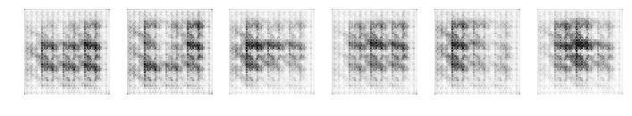

# DCGAN using Pytorch
We use the Deep Convolutional Generative Adverserial Network model to generate human eyes and emojis from a random noise fed as input.

Refrence:[Pytorch](https://pytorch.org/)
         [DCGAN paper](https://arxiv.org/abs/1511.06434)  
<br/>
## Requirements

	 1. Pytorch
	 2. torchsummary

<br/>

## Usage

### Prepare Training Dataset 
Create folder named ``data`` . Then create folders according to your class-label names(n folders for n classes).Then place all images into the corresponding folder(class-label).

###### Folder structure

```
Root
│
├── data
│    └── train
│          ├── ONE
│          │    ├── ONE_0.png 
│    	   │	├── ONE_1.png
│    	   │	└── ...
│    	   ├── TWO
│          │    │ 
│    	   │	├── TWO_0.png
│    	   │	└── TWO_1.png
│    	   ├──	.
│    	   └── 	.
│
│ 
│
├── dcgan.ipynb
├── G_chk.pt
└── D_chk.pt 
```
 
> Larger the number and variation in images, larger the accuracy of classification.

### DCGAN Architecture

#### Generator Neural Network

```javascript
----------------------------------------------------------------
        Layer (type)               Output Shape         Param #
================================================================
   ConvTranspose2d-1          [-1, 512, 67, 67]          819712
       BatchNorm2d-2          [-1, 512, 67, 67]            1024
   ConvTranspose2d-3        [-1, 256, 134, 134]         2097408
       BatchNorm2d-4        [-1, 256, 134, 134]             512
   ConvTranspose2d-5        [-1, 128, 268, 268]          524416
       BatchNorm2d-6        [-1, 128, 268, 268]             256
   ConvTranspose2d-7         [-1, 64, 536, 536]          131136
       BatchNorm2d-8         [-1, 64, 536, 536]             128
   ConvTranspose2d-9        [-1, 3, 1072, 1072]            3075
================================================================
Total params: 3577667
Trainable params: 3577667
Non-trainable params: 0
----------------------------------------------------------------
None
```
#### Discriminator Neural Network

```javascript
----------------------------------------------------------------
        Layer (type)               Output Shape         Param #
================================================================
            Conv2d-1           [-1, 64, 32, 32]            3136
            Conv2d-2          [-1, 128, 16, 16]          131200
       BatchNorm2d-3          [-1, 128, 16, 16]             256
            Conv2d-4            [-1, 256, 8, 8]          524544
       BatchNorm2d-5            [-1, 256, 8, 8]             512
            Conv2d-6            [-1, 512, 4, 4]         2097664
       BatchNorm2d-7            [-1, 512, 4, 4]            1024
            Conv2d-8              [-1, 1, 1, 1]            8193
================================================================
Total params: 2766529
Trainable params: 2766529
Non-trainable params: 0
----------------------------------------------------------------
None
```

### Training 

Run the ``dcgan.ipynb`` jupyter notebook to start the Training.

Once the training is completed the result is stored the main folder as ``D_chk_200.pt`` and ``G_chk_200.pt``


###### Loss


###### Output through Epochs



###### Final Generated Images


#### ToDo
- [x] Train.
- [x] Test.
- [x] Predict.
- [x] Save/Load checkpoint.
- [ ] UI for input, output and to download checkpoint.


